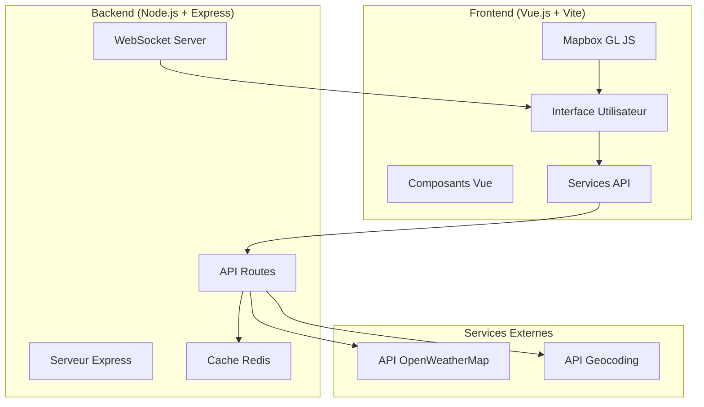

# 🌦️ Application Météo Interactive

Une application web moderne de visualisation météorologique avec carte interactive, développée dans le cadre de la SAE302.

## 📋 Table des matières

- [🎯 À propos du projet](#-à-propos-du-projet)
- [🏗️ Architecture](#️-architecture)
- [✨ Fonctionnalités](#-fonctionnalités)
- [🛠️ Technologies utilisées](#️-technologies-utilisées)
- [📦 Installation](#-installation)
- [🚀 Démarrage](#-démarrage)
- [📁 Structure du projet](#-structure-du-projet)
- [🔧 Configuration](#-configuration)
- [🌐 API](#-api)
- [🤝 Contributeurs](#-contributeurs)
- [📄 Licence](#-licence)

## 🎯 À propos du projet

Cette application météo interactive permet aux utilisateurs de :

- Visualiser la météo actuelle en temps réel
- Consulter les prévisions horaires et journalières
- Naviguer sur une carte interactive (Mapbox)
- Rechercher des villes par nom
- Obtenir sa position géographique automatiquement
- Recevoir des alertes météorologiques

L'application utilise une architecture moderne client-serveur avec mise en cache Redis et communication WebSocket pour les mises à jour en temps réel.

## 🏗️ Architecture



## ✨ Fonctionnalités

### 🗺️ Carte Interactive

- **Navigation fluide** : Zoom, déplacement, rotation 3D
- **Clic pour météo** : Cliquez sur n'importe quel point pour obtenir la météo
- **Géolocalisation** : Bouton pour centrer sur votre position
- **Reset orientation** : Retour à l'orientation Nord

### 🌤️ Données Météorologiques

- **Météo actuelle** : Température, ressenti, humidité, vent, pression
- **Prévisions horaires** : 48h à l'avance
- **Prévisions journalières** : 7 jours à l'avance
- **Alertes météo** : Notifications d'événements climatiques

### 🔍 Recherche et Navigation

- **Recherche de ville** : Autocomplétion et géocodage
- **Historique des recherches** : Sauvegarde locale
- **Interface responsive** : Adaptation mobile et desktop

### ⚡ Performance

- **Cache intelligent** : Redis pour optimiser les requêtes API
- **Mise à jour temps réel** : WebSocket pour les notifications
- **TTL configurable** : Cache adaptatif selon le type de données

## 🛠️ Technologies utilisées

### Frontend

- **Vue.js 3** - Framework JavaScript progressif
- **Vite** - Build tool rapide et moderne
- **Tailwind CSS** - Framework CSS utilitaire
- **Mapbox GL JS** - Cartes interactives
- **Font Awesome** - Icônes vectorielles

### Backend

- **Node.js** - Runtime JavaScript serveur
- **Express.js** - Framework web minimaliste
- **Redis** - Base de données en mémoire pour le cache
- **WebSocket (ws)** - Communication temps réel
- **Axios** - Client HTTP pour les API externes

### DevOps

- **Docker & Docker Compose** - Containerisation
- **Nodemon** - Rechargement automatique en développement
- **dotenv** - Gestion des variables d'environnement

### APIs Externes

- **OpenWeatherMap API** - Données météorologiques
- **Geocoding API** - Conversion adresse ↔ coordonnées

## 📦 Installation

### Prérequis

- [Docker](https://www.docker.com/) et [Docker Compose](https://docs.docker.com/compose/)
- Clé API [OpenWeatherMap](https://openweathermap.org/api) (gratuite)
- Git (pour cloner le repository)

### 🚀 Démarrage Rapide (Recommandé)

**Option 1 : Script automatique (Windows)**

```bash
# Cloner le projet
git clone https://github.com/opsiexe/SAE302-LD-MV-MD.git
cd SAE302-LD-MV-MD

# Double-cliquer sur start.bat
# OU exécuter depuis PowerShell :
.\start.bat
```

**Option 2 : Script automatique (Linux/Mac)**

```bash
# Cloner le projet
git clone https://github.com/opsiexe/SAE302-LD-MV-MD.git
cd SAE302-LD-MV-MD

# Rendre le script exécutable et lancer
chmod +x start.sh
./start.sh
```

**Option 3 : Installation manuelle**

1. **Cloner le repository**

```bash
git clone https://github.com/opsiexe/SAE302-LD-MV-MD.git
cd SAE302-LD-MV-MD
```

2. **Configurer les variables d'environnement**

```bash
# Copier le fichier d'exemple
cp backend/.env.example backend/.env

# Éditer backend/.env et ajouter votre clé API
# WEATHER_API_KEY=votre_cle_api_ici
# GEOCODING_API_KEY=votre_cle_api_ici
```

3. **Lancer avec Docker Compose**

```bash
docker-compose up --build -d
```

4. **Valider l'installation**

```bash
# Vérifier que tout fonctionne
docker-compose exec backend node validate-env.js

# Tester le backend
curl http://localhost:5000/ping
```

5. **Accéder à l'application**
   - Frontend : http://localhost:3000
   - Backend : http://localhost:5000

### 📝 Obtenir une clé API OpenWeather

1. Créez un compte sur [OpenWeatherMap](https://openweathermap.org/api)
2. Allez dans "API keys"
3. Copiez votre clé
4. Collez-la dans `backend/.env` :
   ```
   WEATHER_API_KEY=votre_cle_copiee
   GEOCODING_API_KEY=votre_cle_copiee
   ```

⚠️ **Note :** Les nouvelles clés API peuvent prendre jusqu'à 2 heures pour être activées.

## 📁 Structure du projet

```
SAE302-LD-MV-MD/
├── 📄 README.md                 # Documentation du projet
├── 📄 LICENCE                   # Licence MIT
├── � CHANGELOG.md              # ✨ Journal des modifications
├── 📄 TROUBLESHOOTING.md        # ✨ Guide de dépannage complet
├── 📄 FIXES_SUMMARY.md          # ✨ Résumé des corrections v2.0
├── 🐳 docker-compose.yml        # Configuration Docker (✅ corrigé)
├── 🚀 start.bat                 # ✨ Script démarrage Windows
├── 🚀 start.sh                  # ✨ Script démarrage Linux/Mac
│
├── 📂 backend/                  # API Node.js + Express
│   ├── 🐳 Dockerfile           # Image Docker backend
│   ├── 📦 package.json         # Dépendances Node.js
│   ├── 🚀 server.js            # Point d'entrée serveur (✅ gestion erreur améliorée)
│   ├── 🔧 validate-env.js      # ✨ Script validation environnement
│   ├── 📋 .env.example         # Exemple de configuration
│   └── 🔒 .env                 # Variables d'environnement (à créer)
│
└── 📂 frontend/                 # Application Vue.js
    ├── 🐳 Dockerfile           # Image Docker frontend
    ├── 📦 package.json         # Dépendances frontend
    ├── ⚙️ vite.config.js       # Configuration Vite
    ├── 🌐 index.html           # Point d'entrée HTML
    │
    ├── 📂 public/              # Assets statiques
    │   └── 🖼️ vite.svg
    │
    └── 📂 src/                 # Code source Vue.js
        ├── 🎯 App.vue          # Composant racine (✅ import corrigé)
        ├── ⚙️ config.js        # Configuration API
        │
        ├── 📂 components/       # Composants Vue
        │   ├── Dashboard.vue    # ✅ Import + gestion erreur
        │   ├── searchBar.vue    # Barre de recherche
        │   ├── Map.vue          # Carte interactive
        │   ├── CurrentWeatherCard.vue
        │   └── GeoLocationButton.vue
        │
        └── 📂 services/         # Services API
            └── weatherAPI.js    # ✅ Timeout + gestion erreur
        ├── 🚀 main.js          # Point d'entrée JS
        ├── ⚙️ config.js        # Configuration app
        ├── 🎨 style.css        # Styles globaux
        ├──
        ├── 📂 assets/          # Ressources
        │   └── 🖼️ vue.svg
        ├──
        ├── 📂 components/      # Composants Vue
        │   ├── 🌤️ CurrentWeatherCard.vue    # Carte météo actuelle
        │   ├── 📊 Dashboard.vue              # Tableau de bord
        │   ├── 📍 GeoLocationButton.vue      # Bouton géolocalisation
        │   ├── 🗺️ Map.vue                   # Composant carte Mapbox
        │   └── 🔍 searchBar.vue             # Barre de recherche
        └──
        └── 📂 services/        # Services et utilitaires
            ├── 🌐 weatherAPI.js             # Client API météo
            └── 📋 api_response.example      # Exemple réponse API
```

## 🔧 Configuration

### Variables d'environnement Backend

| Variable              | Description                    | Valeur par défaut        |
| --------------------- | ------------------------------ | ------------------------ |
| `OPENWEATHER_API_KEY` | Clé API OpenWeatherMap         | **Obligatoire**          |
| `PORT`                | Port du serveur backend        | `5000`                   |
| `NODE_ENV`            | Environnement d'exécution      | `development`            |
| `REDIS_URL`           | URL de connexion Redis         | `redis://localhost:6379` |
| `CACHE_TTL_CURRENT`   | TTL cache météo actuelle (sec) | `300` (5 min)            |
| `CACHE_TTL_FORECAST`  | TTL cache prévisions (sec)     | `3600` (1h)              |

### Configuration Frontend

Le fichier `frontend/src/config.js` gère automatiquement la détection de l'environnement :

```javascript
export const config = {
  apiBaseUrl: (() => {
    // Auto-détection localhost vs IP réseau
    if (window.location.hostname === "localhost") {
      return "http://localhost:5000";
    }
    return `http://${window.location.hostname}:5000`;
  })(),
};
```

## 🌐 API

### Endpoints Backend

| Méthode | Endpoint            | Description                  | Paramètres         |
| ------- | ------------------- | ---------------------------- | ------------------ |
| `GET`   | `/ping`             | Test de santé du serveur     | -                  |
| `GET`   | `/weather/current`  | Météo actuelle               | `lat`, `lon`       |
| `GET`   | `/weather/hourly`   | Prévisions horaires (48h)    | `lat`, `lon`       |
| `GET`   | `/weather/daily`    | Prévisions journalières (7j) | `lat`, `lon`       |
| `GET`   | `/weather/alerts`   | Alertes météorologiques      | `lat`, `lon`       |
| `GET`   | `/geocoding/search` | Recherche de ville           | `city` (nom ville) |

### Exemple d'utilisation

```javascript
// Météo actuelle
const weather = await fetch("/weather/current?lat=48.8566&lon=2.3522");
const data = await weather.json();

// Recherche de ville
const city = await fetch("/geocoding/search?q=Paris");
const cityData = await city.json();
```

### Format des réponses

**Météo actuelle** :

```json
{
  "lat": 21,
  "lon": 55,
  "timezone": "Asia/Riyadh",
  "timezone_offset": 10800,
  "current": {
    "dt": 1759914480,
    "sunrise": 1759889575,
    "sunset": 1759932116,
    "temp": 37.91,
    "feels_like": 37.24,
    "pressure": 1008,
    "humidity": 23,
    "dew_point": 13.2,
    "uvi": 8.79,
    "clouds": 1,
    "visibility": 10000,
    "wind_speed": 1.85,
    "wind_deg": 176,
    "wind_gust": 1.52,
    "weather": [
      {
        "id": 800,
        "main": "Clear",
        "description": "ciel dégagé",
        "icon": "01d"
      }
    ]
  }
}
```

## 🤝 Contributeurs

- **Matheo DORSEUIL** - Développement principal
- **Lois DAPZOL** - Frontend et design
- **Mathis VILLA** - Backend et infrastructure

## 📄 Licence

Ce projet est sous licence MIT. Voir le fichier [LICENCE](./LICENCE) pour plus de détails.

---

## 🔗 Liens utiles

- [Documentation Vue.js](https://vuejs.org/guide/)
- [Documentation Express.js](https://expressjs.com/)
- [API OpenWeatherMap](https://openweathermap.org/api)
- [Documentation Mapbox GL JS](https://docs.mapbox.com/mapbox-gl-js/)
- [Docker Compose](https://docs.docker.com/compose/)

## 🆘 Support & Dépannage

### Problèmes courants et solutions

#### 🔄 Écran de chargement infini lors de la recherche d'une ville

**Causes possibles :**

1. **Backend non démarré** : Le frontend ne peut pas se connecter au serveur

   ```bash
   # Vérifier l'état des conteneurs
   docker-compose ps

   # Redémarrer les services
   docker-compose restart
   ```

2. **Clé API OpenWeather invalide ou expirée**

   - Vérifiez que votre clé API est correcte dans le fichier `.env` du backend
   - Vérifiez les limites de votre compte OpenWeather (appels/jour)
   - Les logs backend montreront : `OpenWeather API error: 401`

3. **Problème de cache Redis**

   ```bash
   # Redémarrer Redis
   docker-compose restart redis
   ```

4. **Timeout réseau**
   - Les requêtes expirent après 15 secondes
   - Vérifiez votre connexion Internet
   - Les logs frontend montreront : "La requête a expiré"

**Solution rapide :**

```bash
# Arrêter tous les services
docker-compose down

# Reconstruire et redémarrer
docker-compose up --build -d

# Vérifier les logs
docker-compose logs -f backend
```

#### 📁 Erreur : Cannot find module './components/Map.vue'

**Problème :** Casse (majuscule/minuscule) incorrecte dans les imports

- ✅ Corrigé : Les imports correspondent maintenant aux noms de fichiers exacts

#### 🐳 Docker ne trouve pas le dossier frontend

**Problème :** docker-compose pointait vers `./Frontend` (majuscule)

- ✅ Corrigé : docker-compose.yml pointe maintenant vers `./frontend` (minuscule)

#### 🌐 Erreur CORS ou connexion refusée

**Causes :**

1. Le backend n'est pas accessible sur le port 5000
2. Problème de configuration réseau Docker

**Solutions :**

```bash
# Vérifier les ports
docker-compose ps

# Vérifier que le port 5000 est libre
netstat -an | findstr 5000

# Recréer le réseau Docker
docker-compose down
docker network prune
docker-compose up -d
```

#### 💾 Erreur Redis : Connection refused

**Solution :**

```bash
# Vérifier que Redis est démarré
docker-compose logs redis

# Redémarrer Redis
docker-compose restart redis
```

### Commandes utiles

```bash
# Voir les logs de tous les services
docker-compose logs -f

# Voir les logs d'un service spécifique
docker-compose logs -f backend
docker-compose logs -f frontend
docker-compose logs -f redis

# Vérifier l'état des conteneurs
docker-compose ps

# Redémarrer un service
docker-compose restart [service]

# Reconstruire après modifications du code
docker-compose up --build -d

# Nettoyer et repartir de zéro
docker-compose down -v
docker-compose up --build -d
```

### Vérifications de base

1. **Variables d'environnement** : Vérifiez le fichier `.env` du backend

   ```
   WEATHER_API_KEY=votre_cle_api
   GEOCODING_API_KEY=votre_cle_api
   REDIS_URL=redis://redis:6379
   PORT=5000
   ```

2. **Clé API OpenWeather** : Testez-la avec curl

   ```bash
   curl "https://api.openweathermap.org/data/3.0/onecall?lat=48.8566&lon=2.3522&appid=VOTRE_CLE&units=metric"
   ```

3. **Connectivité réseau** : Testez l'accès au backend
   ```bash
   curl http://localhost:5000/ping
   # Devrait retourner : {"message":"pong"}
   ```

### Messages d'erreur courants

| Message                                 | Cause                      | Solution                       |
| --------------------------------------- | -------------------------- | ------------------------------ |
| "Impossible de se connecter au serveur" | Backend non démarré        | `docker-compose up -d backend` |
| "La requête a expiré"                   | Timeout réseau (>15s)      | Vérifier connexion Internet    |
| "Ville introuvable"                     | Nom de ville incorrect     | Vérifier l'orthographe         |
| "Clé API invalide"                      | Clé OpenWeather incorrecte | Vérifier le fichier `.env`     |
| "Limite API atteinte"                   | Quota OpenWeather dépassé  | Attendre ou upgrader le plan   |

Pour signaler un bug ou demander une fonctionnalité, ouvrez une [issue](https://github.com/opsiexe/SAE302-LD-MV-MD/issues) sur GitHub.
